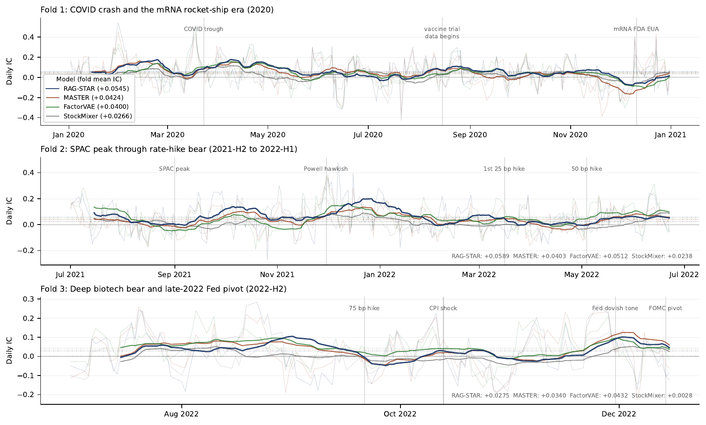

# Spatio-Temporal Attention Ranker (RAG-STAR)

**RAG-STAR** is a Regime-Adaptive Retrieval-Augmented Graph for cross-sectional
stock ranking on biotech equities. The model combines a spatio-temporal
attention backbone with two distinct retrieval banks (a day-level regime
memory and an open-world IPO analogue memory), a macro-conditioned dynamic
graph blending correlation and rate sensitivity, and a regime-gated additive
macro rate-sensitivity head.

This repository is the public code mirror; paper drafts and internal
documents are kept in a private repository.

## Architecture


The pipeline reads left-to-right as six stages:

1. **Inputs** — prices (OHLCV), edge features (FDA / clinical-trial events),
   social signals (StockTwits, Reddit), and a 28-d daily macro vector
   (Treasury yields, BAA-Treasury spread, VIX, VXN, sector ETF returns).
2. **Spatio-Temporal Attention Backbone (STAB)** — a 2-layer Transformer with
   spatial attention over top-K reliability-shrunk neighbours per day and
   temporal attention over a 20-day window per active (day, ticker).
   `d_model = 128`, 4 heads, FF 256, dropout 0.1.
3. **Dual-Bank Retrieval** — a day-level regime bank that retrieves the M=8
   most regime-similar past trading days from a 14-d market-state key, plus
   an open-world IPO analogue bank that retrieves comparable newly-listed
   ticker trajectories from a 22-d per-ticker lifecycle key.
4. **Dynamic Graph Blending** — a macro-conditioned topology gate that
   mixes a survivorship-corrected reliability-shrunk correlation graph with
   a hand-engineered rate-sensitivity graph.
5. **Macro Rate-Sensitivity Head** — a regime-gated additive residual
   conditioned on the same daily macro state.
6. **Output** — cross-sectional ranking score over the 244-ticker biotech
   universe.

The model is **fully ticker-inductive**: there are no per-ticker embeddings
or learned identity tables. Every component is a function of observable
per-(day, ticker) features, so the model can score never-before-seen tickers
at inference time given $\geq$ 20 trading days of post-listing history.

## Baseline comparison

Cross-sectional ranking metrics on a 244-ticker biotech panel under a
3-fold walk-forward protocol with 5-day embargo, 5 seeds, and a 4-check
leakage audit. **Bold** marks per-column best.

| Model        | Type                       | Venue    | F1 IC     | F2 IC     | F3 IC      | 3-fold IC | rank IC   | NDCG@10   | NDCG@50   |
|--------------|----------------------------|----------|-----------|-----------|------------|-----------|-----------|-----------|-----------|
| MERA         | Retrieval-augmented        | WWW'25   | +0.0098   | +0.0118   | +0.0038    | +0.0085   | +0.0147   | 0.6068    | 0.7292    |
| StockMixer   | MLP-Mixer                  | AAAI'24  | +0.0175   | +0.0124   | +0.0018    | +0.0106   | +0.0097   | 0.6077    | 0.7301    |
| RSR          | Static graph               | TOIS'19  | +0.0395   | +0.0314   | -0.0077    | +0.0211   | +0.0181   | 0.6079    | 0.7304    |
| iTransformer | Time-series                | ICLR'24  | +0.0285   | +0.0314   | +0.0230    | +0.0276   | +0.0283   | 0.6093    | 0.7324    |
| DySTAGE      | Dynamic graph              | ICAIF'24 | +0.0377   | +0.0401   | +0.0115    | +0.0298   | +0.0368   | 0.6068    | 0.7315    |
| MASTER       | Market-guided Transformer  | AAAI'24  | +0.0368   | +0.0319   | +0.0287    | +0.0325   | +0.0318   | 0.6094    | 0.7328    |
| FactorVAE    | Probabilistic factor       | AAAI'22  | +0.0337   | +0.0397   | **+0.0371**| +0.0368   | +0.0379   | 0.6112    | 0.7346    |
| **RAG-STAR (ours)** | Retrieval-augmented graph | --- | **+0.0470** | **+0.0469** | +0.0246 | **+0.0395** | **+0.0403** | **0.6114** | **0.7351** |

**Long-short portfolio performance** (top-25 / bottom-25, 3-fold mean,
$\sqrt{252/5}$ annualisation, net of 5 bps round-trip transaction cost):

| Model        | Annualised return | Sharpe   | Net Sharpe | Max drawdown | Turnover |
|--------------|-------------------|----------|------------|--------------|----------|
| StockMixer   | +38.4%            | 1.46     | 1.38       | -56.2%       | 37.5%    |
| DySTAGE      | +40.6%            | 1.52     | 1.47       | -60.4%       | 23.1%    |
| MASTER       | +55.3%            | 2.09     | 2.05       | -75.7%       | 25.3%    |
| FactorVAE    | +76.3%            | **2.75** | **2.71**   | -52.3%       | **21.5%**|
| **RAG-STAR** | **+75.7%**        | 2.50     | 2.44       | **-48.2%**   | 37.8%    |

RAG-STAR achieves the shallowest maximum drawdown of any model and is
competitive with FactorVAE on annualised return; FactorVAE's narrow Sharpe
edge comes at substantially lower turnover, consistent with its
seasoned-cohort F3 strength.

## Per-fold daily IC across regimes



Per-day daily information coefficient across the three test folds for
RAG-STAR, MASTER, FactorVAE, and StockMixer. Top: Fold 1 (2020 COVID +
mRNA). Middle: Fold 2 (2021-H2 to 2022-H1 rate-hike bear). Bottom: Fold 3
(2022-H2 deep bear + Fed pivot). Thin trace is raw per-day IC, bold line
is 20-day rolling smoothed IC, dotted horizontal lines mark fold mean IC,
labelled vertical lines mark regime events. RAG-STAR widens its lead
through the late-2021 to early-2022 rate-hike onset (F2) and crosses
several times with FactorVAE during the September--November rate-shock
window (F3).

## Repository layout

- `src/v2/` — RAG-STAR architecture: spatio-temporal attention backbone,
  dual-bank retrieval, macro-conditioned dynamic graph blending, macro
  rate-sensitivity head.
- `src/baselines/` — eight cross-sectional ranking baselines retrained
  under the v2 walk-forward protocol.
- `configs/` — YAML configs for the headline model and 13 ablation
  variants (graph-blending: 11 variants; retrieval-bank: 2 variants).
- `scripts/` — analysis utilities (per-day IC extraction, portfolio
  backtest, quintile-monotonicity charting) and Wulver SLURM dispatchers.

## Reproducing experiments

Single (fold, seed) training run for the headline model:

```bash
python -m src.v2.training.train_dow_epistar \
    --config configs/dow_epistar_v23_no_rate_memory.yaml \
    --fold 1 --seed 42
```

Wulver SLURM sweep (3 folds × 5 seeds):

```bash
sbatch scripts/wulver/headline_sweep.sbatch
```

Baselines (each takes a `--fold` and `--seed`):

```bash
python -m src.baselines.train_master_v2 --fold 1 --seed 42
python -m src.baselines.train_factorvae_v2 --fold 1 --seed 42
python -m src.baselines.train_stockmixer_v2 --fold 1 --seed 42
# ... etc
```

Or via the Wulver baseline sweep:

```bash
sbatch scripts/wulver/baselines_v2_3folds.sbatch
```

## Ablation variants

Graph-blending ablation under `configs/rag_star_graph_ablation/`
(11 variants covering NoGraph, RandomGraph, CorrGraphOnly, RateGraphOnly,
FixedBlendGraph, LearnedBlendGraph variants with and without the macro
rate-sensitivity head, plus shuffled controls):

```bash
sbatch scripts/wulver/graph_ablation.sbatch
sbatch scripts/wulver/graph_ablation_2.sbatch
```

Retrieval-bank ablation under `configs/rag_star_retrieval_ablation/`
(day-memory-only, IPO-analogue-only):

```bash
sbatch scripts/wulver/retrieval_ablation.sbatch
```

Portfolio backtest + quintile-monotonicity analysis on existing
predictions:

```bash
python scripts/portfolio_analysis.py
```
