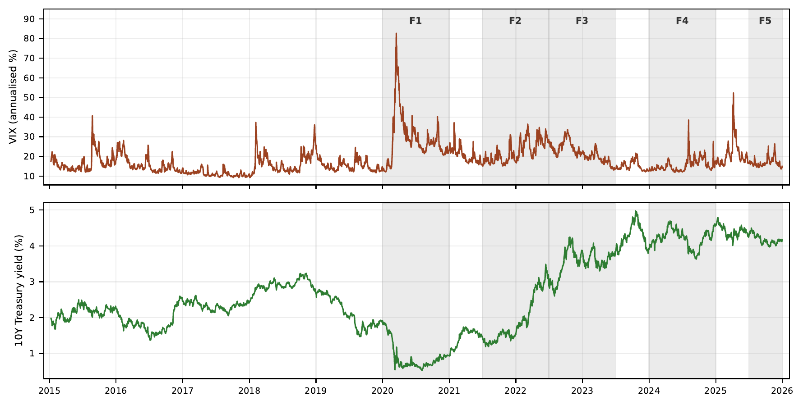
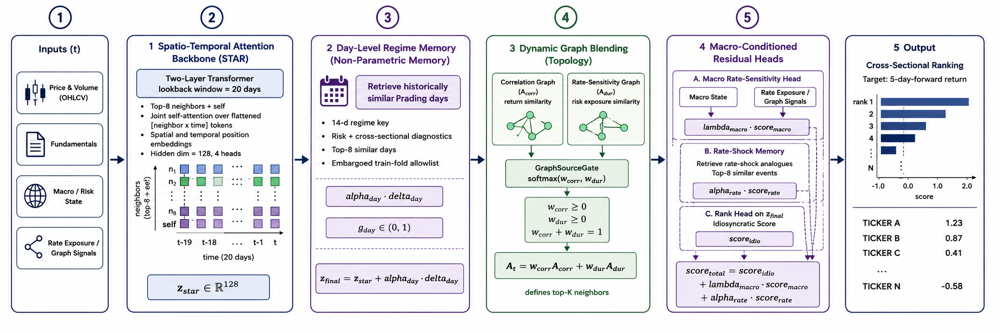
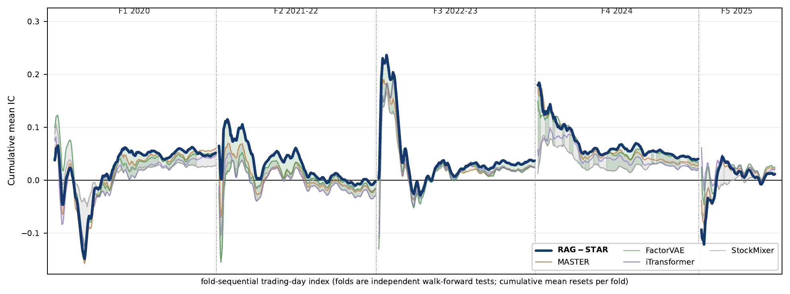

# Spatio-Temporal Attention Ranker (RAG-STAR)

**RAG-STAR** is a Regime-Adaptive Retrieval-Augmented Graph with
Spatio-Temporal Attention for Cross-Sectional Stock Ranking.

Cross-sectional stock ranking on broad equity universes is difficult under
regime stress. Models are typically trained on calm market windows but tested
across drawdowns, rate shocks, and post-shock rebounds, while index
reconstitution simultaneously reshapes the universe. RAG-STAR is a
regime-adaptive retrieval-augmented temporal graph network that combines a
spatio-temporal attention backbone with a day-level regime-memory retrieval
bank reusing historically similar trading days, a macro-conditioned dynamic
graph blending a survivorship-corrected correlation graph with a
rate-sensitivity graph, and a regime-gated macro rate-sensitivity head. On a
600-ticker broad S&P 500 panel (2015-2025), evaluated under a leakage-audited
5-fold walk-forward protocol with a two-regime validation window, RAG-STAR
attains the strongest pooled information coefficient among six retuned
state-of-the-art baselines and is the most regime-balanced, with the smallest
deficit on the hardest rate-rotation fold; the result is positioned as
consistent performance across heterogeneous market regimes rather than a
one-fold advantage. A biotech-sector case study shows the architecture
transfers without modification to a narrower, higher-shock-density universe,
where it specialises further and attains its strongest result.

This repository is the public code mirror; paper drafts and internal
design documents are kept in a private repository.

## Motivation: regime variety over the study period



Macro regime variety over the 600-ticker broad S&P 500 study period
(2015-2025): the CBOE VIX and the 10-year US Treasury yield, with the five
walk-forward test windows (F1-F5) shaded. The folds span a near-zero-rate
COVID shock, the 2022 rate-hike climb, and post-shock normalisation. A model
trained on calm windows must generalise across all of these.

## Architecture



The pipeline has five active stages:

1. **Inputs** — 26 modelled per-(day, ticker) features (10 price/volume,
   4 distress, 4 intangibles, 3 other fundamentals, 3 catalyst, 2 flags),
   an 8-d listing-age vector, a 10-d rolling-beta panel, and a 28-d daily
   macro vector (3M/2Y/10Y Treasury yields, BAA-Treasury spread, VIX/VXN/VVIX,
   11 GICS sector ETFs plus QQQ/SPY returns and realised vols at 5/20 days).
2. **Spatio-Temporal Attention Backbone (STAB)** — a 2-layer Transformer with
   spatial attention over top-K reliability-shrunk neighbours per day and
   temporal attention over a 20-day window per active (day, ticker).
   `d_model = 128`, 4 heads, FF 256, dropout 0.1.
3. **Day-Level Regime Memory** — retrieves the M=8 most regime-similar past
   trading days from a 14-d market-state key (cross-sectional return moments
   at 1/5/20 days, realised-vol mean and dispersion, correlation, dispersion,
   count), with retrieval restricted to days at least 10 trading days in the
   past. Conservatively gated (sigmoid, bias -3).
4. **Macro-Conditioned Dynamic Graph Blending** — a 16-d macro-state gate
   learns a softmax blend between a 60-day rolling reliability-shrunk
   correlation graph (shrinkage tau = 30) and a rate-sensitivity graph
   (cosine similarity over a 10-d rate-sensitivity feature vector).
5. **Macro Rate-Sensitivity Head and Rate-Shock Memory** — a regime-gated
   additive residual conditioned on the 28-d daily macro state, plus an
   M=8 rate-shock memory keyed on daily Treasury and credit-spread moves,
   each fused through a conservatively-initialised gate.

The final score decomposes as
`y(t,i) = y_idio(t,i) + lambda_t * y_dur(t,i) + alpha_t * y_rate(t,i)`,
where `y_idio` is the backbone output (with day-memory fusion and the
macro-conditioned graph), `y_dur` the macro rate-sensitivity head, `y_rate`
the rate-shock memory, and `lambda_t, alpha_t` conservatively-initialised
gates.

The model is **fully ticker-inductive**: there are no per-ticker embeddings
or learned identity tables. Every component is a function of observable
per-(day, ticker) features, so the model can score never-before-seen tickers
at inference time given at least 20 trading days of history.

## Panel and protocol

- **Universe**: point-in-time S&P 500 historical constituents, 2015-01-09 to
  2025-12-23. 600 ever-membered names, roughly 500 active per day, 2,755
  trading days, membership-change aware (about 88% of cells active on average).
- **Five-fold walk-forward**, each fold a distinct macro regime:
  - F1: COVID crash and recovery (test 2020)
  - F2: rate-stress rotation (test 2021-H2 to 2022-H1)
  - F3: post-shock and banking stress (test 2022-H2 to 2023-H1)
  - F4: AI mega-cap rally and Fed pause (test 2024)
  - F5: Fed-cut and post-election (test 2025-H2)
- 5-day embargo at every train-val and val-test boundary; two-regime
  validation window (2017-H2 calm plus 2018-H2 vol-spike) for early stopping.
- 5 seeds (42-46) per cell under a 4-check leakage audit.

## Baseline comparison

Cross-sectional ranking information coefficient (IC) on the broad S&P 500
panel under the 5-fold walk-forward protocol, 5-seed means. **Bold** marks
per-column best.

| Model        | Type                       | Venue    | F1        | F2         | F3        | F4        | F5        | 5-fold pooled IC | Rank IC   |
|--------------|----------------------------|----------|-----------|------------|-----------|-----------|-----------|------------------|-----------|
| StockMixer [[3]](#references)   | MLP-Mixer            | AAAI'24  | +0.0133   | -0.0111    | +0.0149   | +0.0135   | +0.0093   | +0.0080          | +0.0118   |
| MERA [[5]](#references)         | MoE retrieval        | WWW'25   | +0.0322   | -0.0094    | +0.0083   | +0.0097   | -0.0012   | +0.0079          | +0.0153   |
| iTransformer [[6]](#references) | Variate-token Transformer | ICLR'24 | +0.0327 | -0.0247  | +0.0222   | +0.0165   | +0.0155   | +0.0124          | +0.0198   |
| DySTAGE [[1]](#references)      | Spatio-temporal graph | ICAIF'24 | +0.0275  | -0.0066    | +0.0137   | +0.0160   | +0.0117   | +0.0124          | +0.0194   |
| FactorVAE [[7]](#references)    | Probabilistic factor | AAAI'22  | +0.0457   | -0.0147    | +0.0235   | +0.0248   | +0.0216   | +0.0202          | +0.0259   |
| MASTER [[4]](#references)       | Market-guided Transformer | AAAI'24 | **+0.0552** | -0.0158 | +0.0210 | +0.0235   | +0.0200   | +0.0208          | **+0.0274** |
| **RAG-STAR (ours)** | Retrieval-augmented graph | --- | +0.0416 | **-0.0050** | **+0.0301** | **+0.0311** | +0.0089 | **+0.0213** | +0.0265 |

RAG-STAR attains the strongest 5-fold pooled IC (+0.0213), with MASTER
(+0.0208) and FactorVAE (+0.0202) close behind. Per fold the lead rotates:
MASTER takes F1, RAG-STAR takes F2 (least-negative of all seven models), F3,
and F4, and FactorVAE takes F5. No architecture is positive on all five folds
and every one turns negative on F2; RAG-STAR has the smallest absolute F2
deficit, so the rate-stress gap is regime-mediated rather than RAG-STAR
specific.



Cumulative-average daily IC across the five concatenated test folds: RAG-STAR
(bold) versus the baseline min-max envelope. The folds span distinct post-2015
regime archetypes; F2 and F5 carry the largest train-to-test covariate shift.

## Long-short portfolio performance

Daily-rebalanced long top-25 / short bottom-25 equal-weighted book, 5-fold
mean. AR is excess annualised return; IR the information ratio; Net IR
deducts a 5 bps round-trip cost; Max DD is on a non-overlapping
5-day-rebalanced equity curve.

| Model        | AR       | IR       | Net IR   | Max DD     | Turnover |
|--------------|----------|----------|----------|------------|----------|
| StockMixer   | +6.3%    | 0.46     | 0.35     | **-17.6%** | 41.3%    |
| iTransformer | +6.7%    | 0.32     | 0.24     | -29.8%     | 35.0%    |
| FactorVAE    | +8.7%    | 0.40     | 0.33     | -26.5%     | 33.8%    |
| DySTAGE      | +9.9%    | 0.48     | 0.35     | -24.5%     | 56.8%    |
| MASTER       | +11.6%   | 0.42     | 0.35     | -28.0%     | **32.6%**|
| **RAG-STAR** | **+15.4%** | **0.59** | **0.50** | -30.3%   | 43.1%    |

RAG-STAR leads every economic metric: AR +15.4% (next-best MASTER +11.6%),
gross IR 0.59, net IR 0.50, with drawdowns in an economically interpretable
band. Absolute IR is modest because the broad universe has roughly half the
exploitable cross-sectional alpha of a single-sector panel; these numbers are
reported for comparability with prior work, not as a deployable-strategy
claim.

## Component ablation

Single-component removals on the broad S&P 500 panel, 5-seed means.

| Configuration               | F1        | F2        | F3        | F4        | F5        | 5-fold IC |
|-----------------------------|-----------|-----------|-----------|-----------|-----------|-----------|
| full architecture (main)    | +0.0416   | -0.0050   | +0.0301   | +0.0311   | +0.0089   | +0.0213   |
| - macro rate-sens. head     | +0.0333   | -0.0073   | +0.0304   | +0.0330   | +0.0084   | +0.0196   |
| - day-level regime memory   | +0.0423   | -0.0125   | +0.0298   | +0.0263   | +0.0107   | +0.0193   |
| - rate-sens. memory         | +0.0393   | -0.0040   | +0.0261   | +0.0318   | +0.0079   | +0.0202   |
| - rate-sens. graph          | +0.0363   | -0.0137   | +0.0298   | +0.0325   | +0.0122   | +0.0194   |

Every single-component removal leaves the pooled IC close to the full
architecture (+0.0193 to +0.0202): broad-panel performance comes from the
components acting jointly, not from one dominant mechanism. On F2 (the
2021-22 rate rotation) the day-level regime memory and the rate-sensitivity
graph carry the load, the two largest F2 degradations in the ablation.

## Repository layout

- `src/v2/` — RAG-STAR architecture and training: spatio-temporal attention
  backbone, day-level regime memory, macro-conditioned dynamic graph
  blending, macro rate-sensitivity head, rate-shock memory, and the
  broad-panel data builders.
- `src/baselines/` — cross-sectional ranking baselines (MASTER, FactorVAE,
  StockMixer, iTransformer, DySTAGE, MERA, RSR) retrained under the same
  walk-forward protocol; vendored upstream code under
  `src/baselines/vendored/`.
- `configs/` — YAML configs for the headline broad-panel model
  (`rag_star_universe_v2.yaml`) and ablation variants.
- `scripts/` — analysis utilities (per-day IC extraction, portfolio
  backtest, quintile-monotonicity charting) and SLURM dispatchers under
  `scripts/wulver/`.

## Reproducing experiments

Single (fold, seed) training run for the headline broad-panel model:

```bash
python -m src.v2.training.train_dow_epistar \
    --config configs/rag_star_universe_v2.yaml \
    --fold 1 --seed 42 --two_regime_val \
    --output_dir results/rag_star_universe_v2_two_regime_val
```

Full 5-fold by 5-seed sweep via SLURM:

```bash
sbatch scripts/wulver/rag_star_universe_v2_two_regime_val_sweep.sbatch
```

Baselines under the broad-panel two-regime-validation protocol:

```bash
sbatch scripts/wulver/baselines_universal_two_regime_val_sweep.sbatch
```

Component ablation sweep:

```bash
sbatch scripts/wulver/rag_star_universe_v2_ablations_sweep.sbatch
```

Portfolio backtest and quintile-monotonicity analysis on existing
predictions:

```bash
python scripts/portfolio_analysis.py
```

## References

1. Gu, J., Ye, J., Uddin, A., and Wang, G. (2024). "DySTAGE: Dynamic Graph
   Representation Learning for Asset Pricing via Spatio-Temporal Attention and
   Graph Encodings." In *Proceedings of the 5th ACM International Conference
   on AI in Finance (ICAIF)*, pp. 388-396. ACM.
2. Feng, F., He, X., Wang, X., Luo, C., Liu, Y., and Chua, T.-S. (2019).
   "Temporal Relational Ranking for Stock Prediction." *ACM Transactions on
   Information Systems (TOIS)*, 37(2), 1-30.
3. Fan, J., and Shen, Y. (2024). "StockMixer: A Simple yet Strong MLP-based
   Architecture for Stock Price Forecasting." In *Proceedings of the AAAI
   Conference on Artificial Intelligence (AAAI)*, 38(8), 8389-8397.
4. Li, T., Liu, Z., Shen, Y., Wang, X., Chen, H., and Huang, S. (2024).
   "MASTER: Market-Guided Stock Transformer for Stock Price Forecasting." In
   *Proceedings of the AAAI Conference on Artificial Intelligence (AAAI)*.
5. Liu, Y., Song, C., Liu, P., Li, N., Dai, T., Bao, J., Jiang, Y., Xia, S.,
   Long, G., Bluestein, M., Chang, Y., Lewin-Eytan, L., Huang, H., and
   Yom-Tov, E. (2025). "MERA: Mixture of Experts with Retrieval-Augmented
   Representation for Modeling Diversified Stock Patterns." In *Companion
   Proceedings of the ACM Web Conference (WWW Companion)*.
6. Liu, Y., Hu, T., Zhang, H., Wu, H., Wang, S., Ma, L., and Long, M. (2024).
   "iTransformer: Inverted Transformers Are Effective for Time Series
   Forecasting." In *International Conference on Learning Representations
   (ICLR)*.
7. Duan, Y., Wang, L., Zhang, Q., and Li, J. (2022). "FactorVAE: A
   Probabilistic Dynamic Factor Model Based on Variational Autoencoder for
   Predicting Cross-Sectional Stock Returns." In *Proceedings of the AAAI
   Conference on Artificial Intelligence (AAAI)*.
